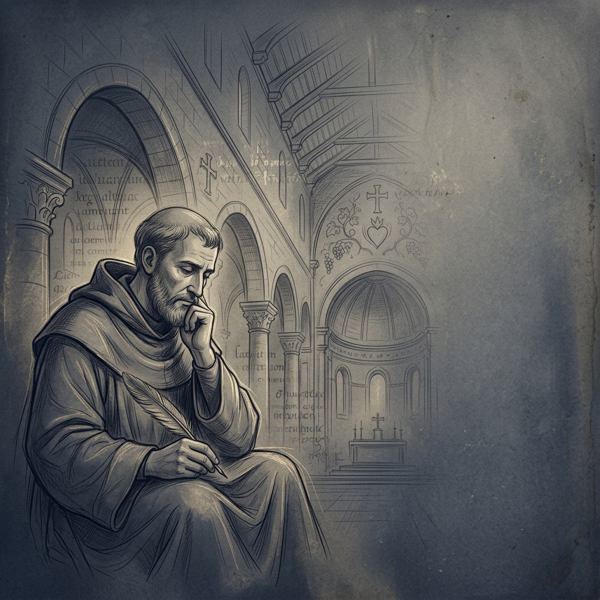

# 📜 Thánh Augustinô: Chủ Nghĩa Hiện Sinh Và Bản Thể Luận Về Tình Yêu

Một nền tảng web định dạng **"Long-read"** học thuật chuyên sâu, được thiết kế riêng để trình bày các nghiên cứu triết học và thần học Công giáo theo tiêu chuẩn tạp chí quốc tế.



## 🏛️ Triết lý Thiết kế (Catholic & Academic UI/UX)
Dự án được xây dựng với sự kết hợp giữa tinh thần chiêm niệm Công giáo và các chuẩn mực học thuật hiện đại:
- **Typography-first:** Sử dụng bộ đôi phông chữ **Playfair Display** (Tiêu đề) và **Lora** (Nội dung) để tối ưu hóa việc đọc dài và hiển thị tiếng Việt hoàn hảo.
- **Bảng màu Phụng vụ:** Kết hợp các tông màu Parchment, Burgundy, Navy và Gold để tạo cảm giác trang nghiêm, cổ điển.
- **Trải nghiệm Chiêm niệm:** Loại bỏ các yếu tố gây xao nhãng, tập trung hoàn toàn vào nội dung và dòng tư tưởng.

## ✨ Tính năng Nổi bật
- 🎨 **Đa Chế độ màu:** Hỗ trợ 3 theme: *Parchment* (Mặc định), *Sepia* (Cổ điển) và *Midnight* (Đêm thanh vắng).
- 🖋️ **Hệ thống Chú thích (Footnotes) Thông minh:** Tự động bắt số chú thích trong văn bản, hiển thị Tooltip mượt mà và hỗ trợ nhảy nhanh đến nguồn trích dẫn.
- 📱 **Tối ưu hóa "Long-read" trên Mobile:** Thanh Header tự ẩn khi cuộn xuống và Mục lục (ToC) dạng ngăn kéo (Drawer) tiện lợi.
- ⏱️ **Reading Progress & Estimation:** Thanh tiến trình cuộn trang và ước tính thời gian đọc dựa trên thuật toán phân tích văn bản.
- 📖 **Artistic Blockquotes & Drop Caps:** Tự động nhận diện các đoạn trích dẫn dài và tạo chữ cái đầu chương nghệ thuật.
- 📑 **Dynamic Table of Contents:** Mục lục tự động highlight chương đang đọc bằng công nghệ `IntersectionObserver`.

## 🛠️ Công nghệ Sử dụng
- **Framework:** [Next.js 15 (App Router)](https://nextjs.org/)
- **Styling:** [Tailwind CSS v4](https://tailwindcss.com/)
- **Animation:** [Framer Motion](https://www.framer.com/motion/)
- **Language:** [TypeScript](https://www.typescriptlang.org/)
- **Font nạp qua Google Fonts:** Lora & Playfair Display (Vietnamese subset).

## 📂 Cấu trúc Thư mục chính
```text
src/
├── app/               # Root layout, metadata & global styles
├── components/        # Các thành phần UI (Footnote, ThemeToggle, ArticleRenderer...)
├── content/           # Chứa file văn bản gốc (thanhaugustino.txt)
├── utils/             # Engine bóc tách văn bản (parser.ts)
└── public/            # Tài nguyên hình ảnh, favicon & icon
```

## 🚀 Cài đặt & Vận hành

1. **Clone dự án:**
   ```bash
   git clone <your-repo-url>
   cd augustino-web
   ```

2. **Cài đặt thư viện:**
   ```bash
   npm install
   ```

3. **Chạy môi trường phát triển:**
   ```bash
   npm run dev
   ```
   Mở [http://localhost:3000](http://localhost:3000) trên trình duyệt.

4. **Build phiên bản sản xuất:**
   ```bash
   npm run build
   ```

## 📝 Cách cập nhật nội dung
Bạn chỉ cần chỉnh sửa file văn bản tại: `src/content/thanhaugustino.txt`. 
Hệ thống Parser sẽ tự động:
- Chuyển `Dòng đầu tiên` thành Tiêu đề chính (H1).
- Chuyển các dòng khớp với danh sách tiêu đề chương thành `H2`, `H3`.
- Tự động bóc tách `Nguồn trích dẫn` ở cuối file để tạo hệ thống Chú thích liên kết toàn bài.

---
*Dự án được thực hiện với tình yêu dành cho Triết học và Thần học.* ⛪📖
